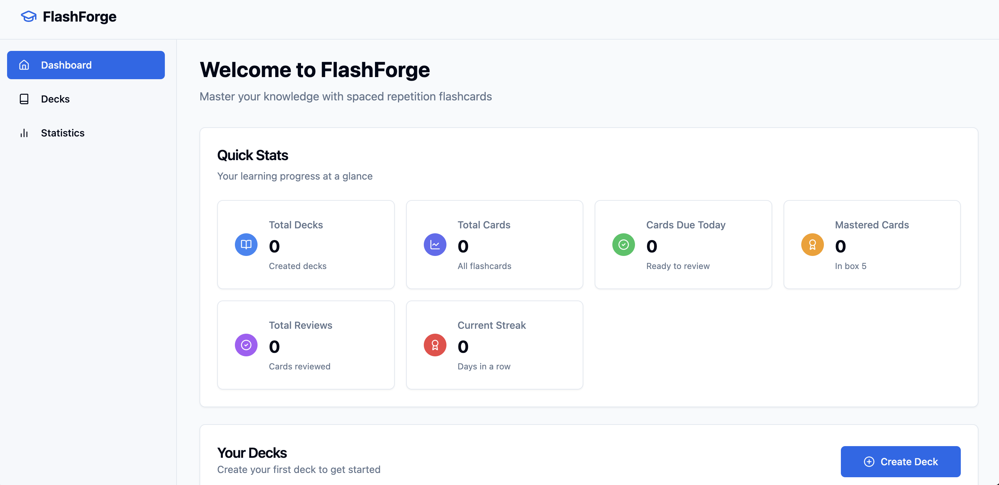

# 🧠 FlashForge – Spaced Repetition Flashcard Web App

**FlashForge** is a sleek, responsive flashcard learning platform that uses **spaced repetition** to help users remember information more effectively. Designed for students, language learners, and professionals, FlashForge makes studying fast, efficient, and even fun.

 <!-- Replace with your actual screenshot file -->

---

## 🚀 Features

- 📚 **Deck Management** – Create and organize flashcard decks  
- ✍️ **Flashcard Editor** – Add, edit, delete cards (front/back)  
- 🔁 **Spaced Repetition** – Uses a simplified Leitner system to optimize memory retention  
- 🎴 **Card Flipping** – Flip cards with smooth animations  
- 📊 **Review Stats** – Track your daily progress and mastery levels  
- 💾 **Local Storage** – Saves progress on your device without login  

---

## 🧰 Tech Stack

| Area           | Tech                          |
|----------------|-------------------------------|
| Frontend       | [React](https://reactjs.org/) + [Vite](https://vitejs.dev/)  
| Styling        | [Tailwind CSS](https://tailwindcss.com/)  
| Animations     | [Framer Motion](https://www.framer.com/motion/) / CSS  
| State Handling | [Zustand](https://github.com/pmndrs/zustand) or Context API  
| Charts         | [Chart.js](https://www.chartjs.org/) or [Recharts](https://recharts.org/)  
| Data Storage   | Browser `localStorage`  
| Deployment     | [Vercel](https://vercel.com/) / [Netlify](https://www.netlify.com/)  

---


## 🧠 How Spaced Repetition Works

FlashForge implements a 3-level Leitner box system:
- ✅ "Know" → Moves card to the next box (reviewed less frequently)
- ❌ "Don’t Know" → Sends card back to Box 1 (reviewed again soon)
- Only due cards are shown during review sessions

---

## 🛠️ Getting Started

```bash
git clone https://github.com/yourusername/flashforge.git
cd flashforge
npm install
npm run dev
